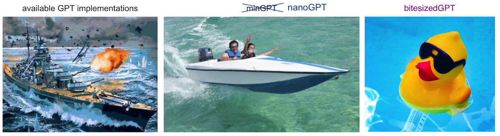

Bitesized GPT
=============

Bitesized GPT is a simplified implementation based on Andrej Karpathy's
transformer tutorial
  [Let's build GPT: from scratch, in code, spelled out](https://www.youtube.com/watch?v=kCc8FmEb1nY)
and his public transformer implementation
  [nanoGPT](https://github.com/karpathy/nanoGPT).

The main differences are:

* This transformer arhcitecture is simpler than nanoGPT (e.g. no dropout).
* This implementation uses ASCII codepoints=characters=bytes directly
  (instead of a small subset of unicode as in the tutorial, or BPE tokens as
  in nanoGPT).
* We use the full Sherlock Holmes canon as a data set (rather than complete
  works of Shakespeare).
* The total lines of code is just 264 (compared to ~600 for nanoGPT).

Whereas nanoGPT can fit on my laptop, bitesizedGPT can fit in my head.

I highly recommend studying Karpathy's resources and then making something
like this project (or studying this repository) if you are interested in
coding and training transformer architectures.

(Figure adapted from [nanoGPT](https://github.com/karpathy/nanoGPT).)
